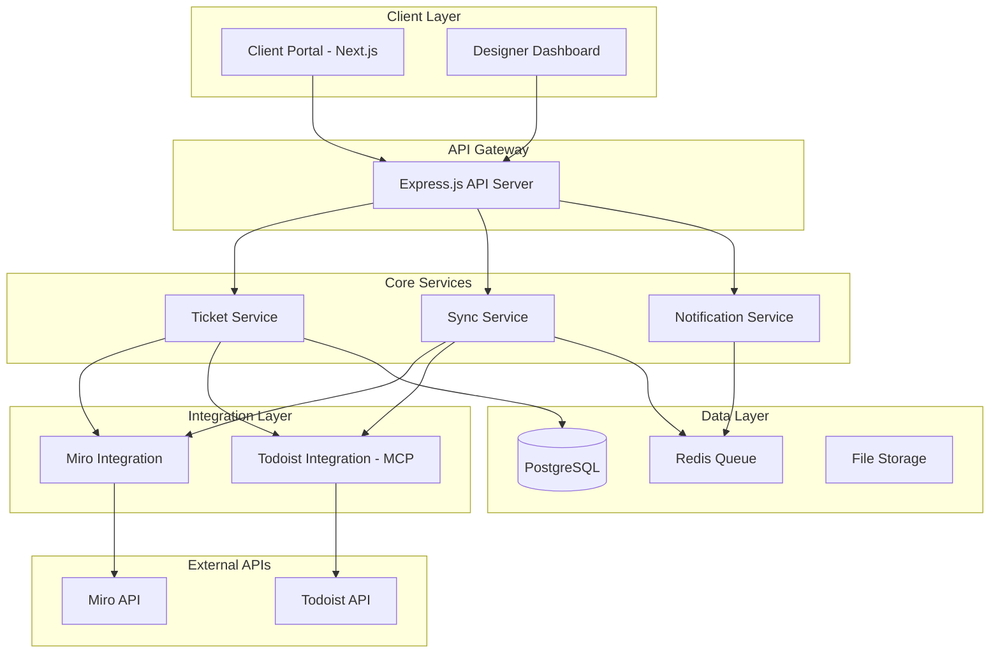
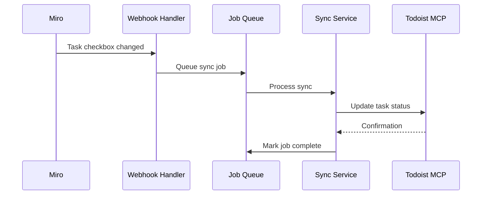

# Design Document

## Overview

The Ticket Management System is a microservices-based platform that orchestrates client ticket submissions with automated Miro board creation and Todoist project management. The system uses event-driven architecture with webhook-based synchronization to maintain real-time consistency across all platforms.

## Architecture

### High-Level Architecture



### Technology Stack

**Frontend:**
- Next.js 14 with TypeScript
- Tailwind CSS for styling
- React Hook Form for form management
- React Query for data fetching
- Zustand for state management

**Backend:**
- Node.js 20+ with Express.js
- TypeScript for type safety
- Prisma ORM for database operations
- Bull Queue for job processing
- JWT for authentication

**Integrations:**
- Miro SDK (@mirohq/miro-api)
- Custom MCP Server for Todoist
- Webhook endpoints for real-time sync

**Infrastructure:**
- PostgreSQL for primary data storage
- Redis for caching and job queues
- File storage for attachments (S3-compatible)

## Components and Interfaces

### 1. Client Portal (Frontend)

**Purpose:** Web interface for clients to submit tickets and track progress

**Key Components:**
- Authentication module (email + access code)
- Ticket submission form with file upload
- Progress tracking dashboard
- Comment/feedback system

**API Integration:**
```typescript
interface ClientPortalAPI {
  // Authentication
  login(email: string, accessCode: string): Promise<AuthResponse>
  
  // Ticket Management
  createTicket(ticketData: TicketSubmission): Promise<TicketResponse>
  getTicket(ticketId: string): Promise<TicketDetails>
  getTicketStatus(ticketId: string): Promise<StatusResponse>
  
  // Communication
  addComment(ticketId: string, comment: string): Promise<void>
  uploadAttachment(ticketId: string, file: File): Promise<AttachmentResponse>
}
```

### 2. Ticket Service (Backend)

**Purpose:** Core business logic for ticket processing and orchestration

**Responsibilities:**
- Validate and process ticket submissions
- Generate unique ticket identifiers
- Orchestrate Miro and Todoist creation
- Manage ticket lifecycle and status updates

**Key Methods:**
```typescript
class TicketService {
  async createTicket(data: TicketSubmission): Promise<Ticket> {
    // 1. Validate submission data
    // 2. Generate ticket number (TICK-YYYY-NNN)
    // 3. Save to database
    // 4. Queue Miro board creation
    // 5. Queue Todoist project creation
    // 6. Return ticket details
  }
  
  async updateTicketStatus(ticketId: string, status: TicketStatus): Promise<void>
  async getTicketDetails(ticketId: string): Promise<TicketDetails>
  async processWebhookEvent(source: string, event: WebhookEvent): Promise<void>
}
```

### 3. Miro Integration Service

**Purpose:** Manages Miro board creation and synchronization

**Board Structure Creation:**
```typescript
interface MiroBoardStructure {
  clientInfoFrame: {
    title: string
    widgets: {
      clientDetails: StickyNoteWidget
      briefing: TextWidget
      visualReferences: ImageWidget[]
      brandGuidelines: StickyNoteWidget
    }
  }
  
  designFrame: {
    title: "🎨 DESIGN & REVISÕES"
    workArea: EmptyFrame
    instructions: TextWidget
  }
  
  reportFrame: {
    title: "📊 PROJECT REPORT"
    widgets: {
      taskCheckboxes: ShapeWidget[]
      timeline: TextWidget
      communicationLog: TextWidget
    }
  }
}
```

**Sync Operations:**
```typescript
class MiroSyncService {
  async createBoardStructure(ticket: Ticket): Promise<MiroBoardStructure>
  async updateTaskStatus(widgetId: string, completed: boolean): Promise<void>
  async addCommunicationEntry(frameId: string, message: string): Promise<void>
  async handleWebhookEvent(event: MiroWebhookEvent): Promise<void>
}
```

### 4. Todoist Integration (MCP Server)

**Purpose:** Manages Todoist project creation and task synchronization

**MCP Tools:**
```typescript
interface TodoistMCPTools {
  create_project_from_ticket: {
    parameters: {
      ticketNumber: string
      title: string
      serviceType: string
      deadline: string
      priority: string
    }
    returns: {
      projectId: string
      taskIds: TaskMapping[]
      projectUrl: string
    }
  }
  
  sync_task_completion: {
    parameters: {
      taskId: string
      completed: boolean
    }
    returns: { success: boolean }
  }
  
  get_project_progress: {
    parameters: { projectId: string }
    returns: {
      total: number
      completed: number
      percentage: number
      overdue: number
    }
  }
}
```

**Task Templates by Service Type:**
```typescript
const SERVICE_TEMPLATES = {
  logo: [
    { name: 'Análise do briefing', daysOffset: 0, priority: 4 },
    { name: 'Pesquisa e moodboard', daysOffset: 1, priority: 3 },
    { name: 'Conceitos iniciais (3 versões)', daysOffset: 3, priority: 4 },
    { name: 'Revisão 1', daysOffset: 5, priority: 3 },
    { name: 'Refinamento', daysOffset: 7, priority: 3 },
    { name: 'Revisão final', daysOffset: 9, priority: 4 },
    { name: 'Entrega de arquivos finais', daysOffset: 10, priority: 4 }
  ],
  website: [
    { name: 'Análise do briefing', daysOffset: 0, priority: 4 },
    { name: 'Arquitetura de informação', daysOffset: 2, priority: 4 },
    { name: 'Wireframes', daysOffset: 5, priority: 3 },
    { name: 'Design de UI', daysOffset: 10, priority: 4 },
    { name: 'Revisão do cliente', daysOffset: 15, priority: 3 },
    { name: 'Ajustes finais', daysOffset: 18, priority: 3 },
    { name: 'Entrega de arquivos', daysOffset: 20, priority: 4 }
  ],
  branding: [
    { name: 'Análise do briefing', daysOffset: 0, priority: 4 },
    { name: 'Pesquisa de mercado', daysOffset: 2, priority: 3 },
    { name: 'Estratégia de marca', daysOffset: 5, priority: 4 },
    { name: 'Conceitos de identidade', daysOffset: 8, priority: 4 },
    { name: 'Desenvolvimento do sistema', daysOffset: 12, priority: 3 },
    { name: 'Manual de marca', daysOffset: 16, priority: 3 },
    { name: 'Apresentação final', daysOffset: 18, priority: 4 }
  ]
}
```

### 5. Synchronization Engine

**Purpose:** Maintains bidirectional sync between Miro and Todoist

**Sync Flow:**


**Conflict Resolution:**
- Last-write-wins strategy for simultaneous updates
- Audit logging for all sync operations
- Retry mechanism with exponential backoff
- Dead letter queue for failed operations

## Data Models

### Core Entities

```typescript
interface Ticket {
  id: string
  ticketNumber: string // TICK-YYYY-NNN
  clientId: string
  title: string
  description: string
  serviceType: 'logo' | 'website' | 'branding'
  priority: 'normal' | 'high' | 'urgent'
  status: 'pending' | 'in_progress' | 'review' | 'completed'
  deadline: Date
  
  // Integration IDs
  miroBoardId?: string
  miroFrameIds: {
    clientInfo: string
    design: string
    report: string
  }
  todoistProjectId?: string
  
  // Metadata
  createdAt: Date
  updatedAt: Date
}

interface Client {
  id: string
  name: string
  email: string
  company?: string
  accessCode: string
  createdAt: Date
}

interface TaskMapping {
  id: string
  ticketId: string
  todoistTaskId: string
  miroWidgetId: string
  taskName: string
  taskOrder: number
  completed: boolean
  syncedAt: Date
}

interface BrandInfo {
  id: string
  ticketId: string
  colors: string[]
  fonts: string[]
  styleKeywords: string[]
  logoUrl?: string
}

interface Attachment {
  id: string
  ticketId: string
  fileName: string
  fileUrl: string
  fileType: string
  uploadedAt: Date
}

interface CommunicationLog {
  id: string
  ticketId: string
  authorType: 'client' | 'designer' | 'system'
  authorName: string
  message: string
  createdAt: Date
}

interface WebhookEvent {
  id: string
  source: 'miro' | 'todoist'
  eventType: string
  payload: Record<string, any>
  processed: boolean
  createdAt: Date
}
```

### Database Schema

```sql
-- Core tables with relationships and indexes
CREATE TABLE clients (
  id UUID PRIMARY KEY DEFAULT gen_random_uuid(),
  name VARCHAR(255) NOT NULL,
  email VARCHAR(255) UNIQUE NOT NULL,
  company VARCHAR(255),
  access_code VARCHAR(50) UNIQUE NOT NULL,
  created_at TIMESTAMP DEFAULT NOW()
);

CREATE TABLE tickets (
  id UUID PRIMARY KEY DEFAULT gen_random_uuid(),
  ticket_number VARCHAR(50) UNIQUE NOT NULL,
  client_id UUID REFERENCES clients(id) ON DELETE CASCADE,
  title VARCHAR(255) NOT NULL,
  description TEXT,
  service_type VARCHAR(50) NOT NULL CHECK (service_type IN ('logo', 'website', 'branding')),
  priority VARCHAR(20) NOT NULL CHECK (priority IN ('normal', 'high', 'urgent')),
  status VARCHAR(50) NOT NULL CHECK (status IN ('pending', 'in_progress', 'review', 'completed')),
  deadline DATE,
  
  -- Integration IDs
  miro_board_id VARCHAR(255),
  miro_client_frame_id VARCHAR(255),
  miro_design_frame_id VARCHAR(255),
  miro_report_frame_id VARCHAR(255),
  todoist_project_id VARCHAR(255),
  
  created_at TIMESTAMP DEFAULT NOW(),
  updated_at TIMESTAMP DEFAULT NOW()
);

-- Indexes for performance
CREATE INDEX idx_tickets_client_id ON tickets(client_id);
CREATE INDEX idx_tickets_status ON tickets(status);
CREATE INDEX idx_tickets_created_at ON tickets(created_at);
CREATE INDEX idx_task_mappings_ticket_id ON task_mappings(ticket_id);
```

## Error Handling

### Error Categories and Responses

**1. Validation Errors (400)**
- Missing required fields
- Invalid service type or priority
- File upload size/type restrictions

**2. Authentication Errors (401/403)**
- Invalid access code
- Expired session tokens
- Insufficient permissions

**3. Integration Errors (502/503)**
- Miro API rate limits or failures
- Todoist API connectivity issues
- Webhook delivery failures

**4. System Errors (500)**
- Database connection failures
- Job queue processing errors
- Unexpected application errors

### Error Handling Strategy

```typescript
class ErrorHandler {
  static handleIntegrationError(error: IntegrationError): ErrorResponse {
    // Log error with context
    logger.error('Integration failure', {
      service: error.service,
      operation: error.operation,
      ticketId: error.ticketId,
      error: error.message
    })
    
    // Queue retry if appropriate
    if (error.retryable) {
      jobQueue.add('retry-integration', {
        operation: error.operation,
        data: error.originalData,
        attempt: error.attempt + 1
      }, {
        delay: Math.pow(2, error.attempt) * 1000, // Exponential backoff
        attempts: 3
      })
    }
    
    return {
      success: false,
      error: 'Integration temporarily unavailable',
      retryAfter: error.retryable ? 30 : null
    }
  }
}
```

### Retry and Recovery

- **Exponential Backoff:** 1s, 2s, 4s, 8s intervals
- **Circuit Breaker:** Temporarily disable failing integrations
- **Graceful Degradation:** Continue core operations when integrations fail
- **Manual Recovery:** Admin interface for failed operations

## Testing Strategy

### Unit Testing
- **Coverage Target:** 90% for core business logic
- **Framework:** Jest with TypeScript support
- **Focus Areas:**
  - Ticket validation and processing
  - Sync logic and conflict resolution
  - Template generation algorithms
  - Error handling scenarios

### Integration Testing
- **API Endpoints:** Full request/response cycle testing
- **Database Operations:** Transaction integrity and rollback scenarios
- **External APIs:** Mock Miro and Todoist responses
- **Webhook Processing:** Event handling and retry logic

### End-to-End Testing
- **User Flows:** Complete ticket submission to completion
- **Cross-Platform Sync:** Miro ↔ Todoist synchronization
- **Error Recovery:** System behavior during failures
- **Performance:** Load testing with concurrent users

### Testing Environment Setup
```typescript
// Test configuration
const testConfig = {
  database: {
    url: process.env.TEST_DATABASE_URL,
    resetBetweenTests: true
  },
  integrations: {
    miro: {
      useMock: true,
      mockResponses: './test/fixtures/miro-responses.json'
    },
    todoist: {
      useMock: true,
      mockResponses: './test/fixtures/todoist-responses.json'
    }
  },
  redis: {
    url: process.env.TEST_REDIS_URL,
    flushBetweenTests: true
  }
}
```

### Performance Requirements
- **Ticket Creation:** < 2 seconds end-to-end
- **Sync Operations:** < 30 seconds for updates
- **API Response Time:** < 500ms for read operations
- **Concurrent Users:** Support 50+ simultaneous clients
- **Uptime Target:** 99.5% availability