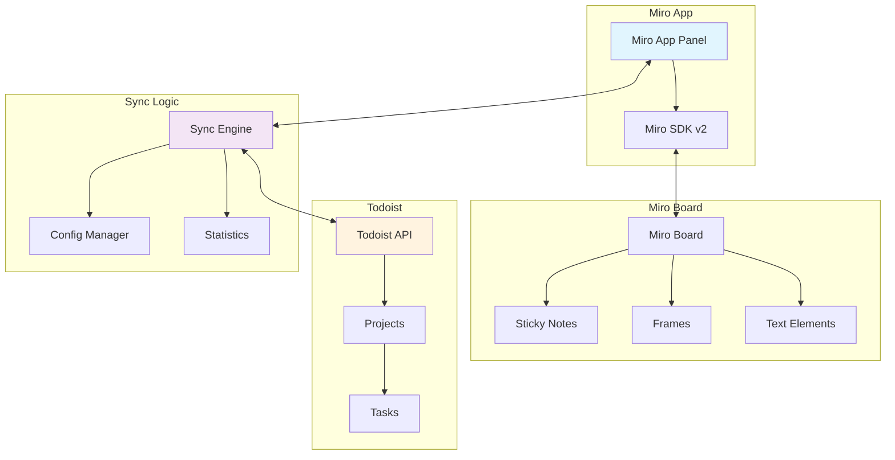

# 🏗️ Arquitetura do Miro-Todoist Sync App

## 📋 Visão Geral

Este app conecta **Miro** (design/visual) com **Todoist** (gestão de tarefas/CRM) para sincronização bidirecional de elementos.

## 🎯 Caso de Uso Atual
- **Todoist**: Gestão de clientes CRM + tarefas
- **Miro**: Design + visualização de tarefas
- **Sincronização**: Bidirecional entre as duas plataformas

## 🏛️ Arquitetura Atual



## 🔄 Fluxo de Dados Atual

### 1. **Todoist → Miro**
```
Todoist API → Get Tasks → Create Frames/Sticky Notes → Position in Grid → Zoom to View
```

### 2. **Miro → Todoist**
```
Miro SDK → Get Elements → Extract Content → Create Todoist Tasks → Update Stats
```

## 📁 Estrutura de Arquivos

```
miro-form-app/
├── panel.html          # Interface principal do app
├── app.js              # Lógica de inicialização
├── style.css           # Estilos do painel
├── index-official.html # Página de registro do app
└── docs/
    ├── ARCHITECTURE.md  # Este arquivo
    ├── SOLUTION.md      # Documentação de soluções
    └── README.md        # Guia de uso
```

## 🧩 Componentes Principais

### 1. **Interface do Painel** (`panel.html`)
- **Configuração**: Token Todoist, URL Make.com, Projeto
- **Controles**: Botões de sincronização
- **Estatísticas**: Contadores em tempo real
- **Opções**: Tipo de elemento (Frames/Sticky Notes)

### 2. **Engine de Sincronização**
```javascript
// Funções principais
- syncToTodoist()     // Miro → Todoist
- syncFromTodoist()   // Todoist → Miro
- updateStats()       // Atualizar contadores
- loadConfig()        // Carregar configurações
```

### 3. **Gestão de Elementos**
- **Sticky Notes**: Elementos tradicionais do Miro
- **Frames**: Containers organizados (recomendado)
- **Text**: Elementos de texto
- **Grid Layout**: Posicionamento inteligente

## 🔧 APIs Utilizadas

### **Miro SDK v2**
```javascript
// Principais métodos
miro.board.get()              // Buscar elementos
miro.board.createFrame()      // Criar frames
miro.board.createStickyNote() // Criar sticky notes
miro.board.viewport.zoomTo()  // Navegar para elemento
```

### **Todoist REST API v2**
```javascript
// Endpoints principais
GET  /rest/v2/projects        // Listar projetos
GET  /rest/v2/tasks           // Listar tarefas
POST /rest/v2/tasks           // Criar tarefa
```

## 📊 Estado Atual vs. Necessidades CRM

### ✅ **Funcionalidades Atuais**
- Sincronização bidirecional básica
- Organização em grid
- Suporte a frames e sticky notes
- Configuração persistente
- Estatísticas em tempo real

### 🎯 **Melhorias Necessárias para CRM**
- **Categorização por cliente**
- **Status de projeto visual**
- **Prioridades e deadlines**
- **Relacionamentos entre tarefas**
- **Templates de projeto**
- **Filtros e visualizações**

## 🚀 Próximos Passos

1. **Mapeamento de Clientes**: Associar projetos Todoist a clientes
2. **Visualização Hierárquica**: Frames por cliente/projeto
3. **Status Visual**: Cores e ícones por status
4. **Templates**: Estruturas pré-definidas para tipos de projeto
5. **Automação**: Webhooks para sincronização em tempo real

---

*Documentação criada em: ${new Date().toLocaleDateString('pt-BR')}*