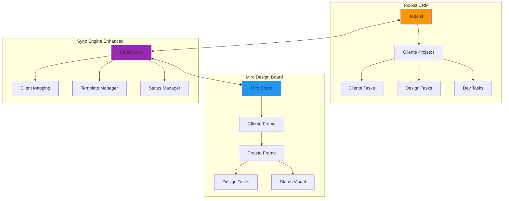

# 🎨 Workflow CRM + Design: Miro ↔ Todoist

## 🎯 Seu Caso de Uso Específico

**Você usa:**
- **Todoist**: Gestão de clientes CRM + controle de tarefas
- **Miro**: Design + visualização de projetos
- **Necessidade**: Melhor representação e sincronização

## 🏗️ Arquitetura Proposta para CRM



## 📋 Estrutura Proposta no Miro

### 🏢 **Nível 1: Cliente Frame**
```
┌─────────────────────────────────────┐
│  🏢 CLIENTE: [Nome do Cliente]      │
│  📊 Status: Ativo | Pausado | Done  │
│  📅 Deadline: [Data]                │
│  ┌─────────────────────────────────┐ │
│  │  📁 PROJETO 1: Website         │ │
│  │  ┌─────────────────────────────┐ │ │
│  │  │ 🎨 Design Homepage         │ │ │
│  │  │ 🎨 Design About           │ │ │
│  │  │ 💻 Dev Frontend           │ │ │
│  │  └─────────────────────────────┘ │ │
│  └─────────────────────────────────┘ │
│  ┌─────────────────────────────────┐ │
│  │  📁 PROJETO 2: App Mobile      │ │
│  └─────────────────────────────────┘ │
└─────────────────────────────────────┘
```

## 🎨 Sistema de Cores e Status

### **Status do Cliente**
- 🟢 **Verde**: Cliente ativo, projetos em andamento
- 🟡 **Amarelo**: Cliente pausado, aguardando feedback
- 🔴 **Vermelho**: Cliente com problemas/atraso
- 🔵 **Azul**: Cliente concluído

### **Status das Tarefas**
- 🟦 **Azul Claro**: Design - A fazer
- 🟪 **Roxo**: Design - Em progresso
- 🟩 **Verde**: Design - Concluído
- 🟨 **Amarelo**: Dev - A fazer
- 🟧 **Laranja**: Dev - Em progresso
- ✅ **Verde Escuro**: Dev - Concluído

## 🔄 Fluxo de Sincronização Melhorado

### **1. Todoist → Miro (Estruturado)**
```javascript
// Estrutura proposta
{
  cliente: "Empresa XYZ",
  projetos: [
    {
      nome: "Website Redesign",
      status: "em_andamento",
      deadline: "2024-02-15",
      tarefas: [
        {
          nome: "Design Homepage",
          tipo: "design",
          status: "concluido",
          responsavel: "Designer"
        },
        {
          nome: "Desenvolvimento Frontend",
          tipo: "dev",
          status: "em_progresso",
          responsavel: "Dev"
        }
      ]
    }
  ]
}
```

### **2. Miro → Todoist (Organizado)**
```javascript
// Mapeamento inteligente
Frame Cliente → Projeto Todoist
├── Frame Projeto → Seção no Todoist
    ├── Task Design → Task com label "design"
    ├── Task Dev → Task com label "dev"
    └── Status → Priority/Labels no Todoist
```

## 🛠️ Melhorias Técnicas Propostas

### **1. Mapeamento Inteligente**
```javascript
const clientMapping = {
  "Empresa XYZ": {
    todoistProjectId: "123456",
    miroFrameId: "frame_xyz",
    color: "blue",
    status: "active"
  }
};
```

### **2. Templates de Projeto**
```javascript
const projectTemplates = {
  "website": {
    tasks: ["Design", "Frontend", "Backend", "Deploy"],
    colors: ["purple", "orange", "red", "green"]
  },
  "app_mobile": {
    tasks: ["UX Research", "UI Design", "Development", "Testing"],
    colors: ["blue", "purple", "orange", "green"]
  }
};
```

### **3. Status Automático**
```javascript
const statusRules = {
  "design_complete": { color: "green", position: "left" },
  "dev_in_progress": { color: "orange", position: "center" },
  "client_review": { color: "yellow", position: "right" }
};
```

## 📊 Dashboard Visual no Miro

### **Layout Proposto**
```
┌─────────────────────────────────────────────────────────┐
│                    📊 DASHBOARD CRM                     │
├─────────────────────────────────────────────────────────┤
│  🏢 CLIENTES ATIVOS (3)    🟡 AGUARDANDO (2)    ✅ DONE (5) │
├─────────────────────────────────────────────────────────┤
│                                                         │
│  🏢 Cliente A          🏢 Cliente B          🏢 Cliente C │
│  ┌─────────────────┐   ┌─────────────────┐   ┌─────────────────┐ │
│  │ 📁 Website      │   │ 📁 App Mobile   │   │ 📁 Branding     │ │
│  │ 🎨🎨💻💻        │   │ 🎨💻🧪         │   │ 🎨🎨✅         │ │
│  │ Status: 75%     │   │ Status: 60%     │   │ Status: 100%    │ │
│  └─────────────────┘   └─────────────────┘   └─────────────────┘ │
└─────────────────────────────────────────────────────────┘
```

## 🚀 Implementação Sugerida

### **Fase 1: Estrutura Base**
1. ✅ Criar frames hierárquicos (Cliente → Projeto → Task)
2. ✅ Sistema de cores por status
3. ✅ Mapeamento cliente-projeto

### **Fase 2: Automação**
1. Templates de projeto
2. Regras de status automático
3. Sincronização em tempo real

### **Fase 3: Analytics**
1. Dashboard de progresso
2. Relatórios visuais
3. Métricas de produtividade

---

**Quer que eu implemente alguma dessas melhorias específicas?** 🚀